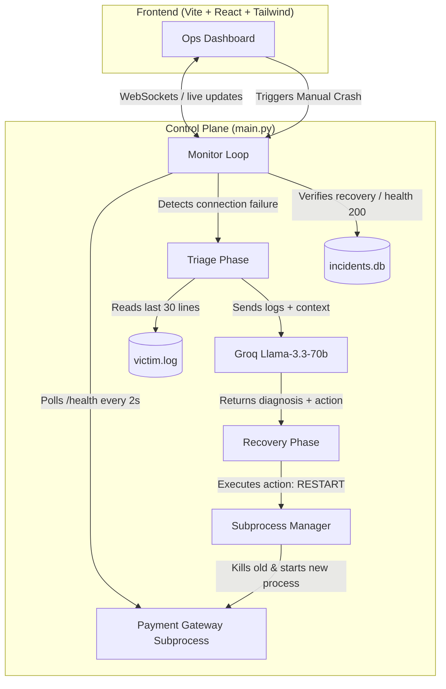

# AIOps Self-Healing Copilot 🧠🩹

[](https://www.python.org/)
[](https://react.dev/)
[](https://tailwindcss.com/)
[](https://fastapi.tiangolo.com/)
[](https://groq.com/)

An autonomous, closed-loop **AIOps Self-Healing Copilot** built for rapid hackathon submission. This system monitors a critical microservice, detects process crashes instantly, leverages an LLM (Llama-3.3-70b via Groq) to diagnose the root cause from recent system logs, and automatically triggers remediation (restarting the microservice) while displaying the entire reasoning cycle live on a premium Grafana-style dashboard.

---

## 🏛 Architecture Overview

The diagram below details the autonomous loop (**Detect ➔ Diagnose ➔ Remediate ➔ Verify**):



---

## 🛠 Tech Stack

* **Target Service ("Victim")**: FastAPI app ([victim_service.py](file:///C:/Users/prakash/Downloads/all-projects/AIOps/victim_service.py)) running on port `8001` that simulates a transaction-handling *Payment Gateway*. It features a hidden `/crash` endpoint to trigger manual process crashes during demos.
* **Control Plane / Monitor**: FastAPI app ([main.py](file:///C:/Users/prakash/Downloads/all-projects/AIOps/main.py)) running on port `8000` that handles background monitoring, stdout log-tailing, SQLite incident logging, and recovery command execution.
* **LLM Engine**: Groq API (`llama-3.3-70b-versatile`) running in JSON mode to evaluate logs and recommend SRE actions (with an automated offline/no-key mock SRE heuristic fallback).
* **Frontend**: Single-page Vite + React dashboard ([App.jsx](file:///C:/Users/prakash/Downloads/all-projects/AIOps/frontend/src/App.jsx)) styled with Tailwind CSS (v4) utilizing monospace terminal elements, blinking state indicators, and an interactive event timeline.
* **Database**: SQLite ([incidents.db](file:///C:/Users/prakash/Downloads/all-projects/AIOps/incidents.db)) for persistent incident history and recovery stats.

---

## ✨ Features

1. **Closed-Loop Autonomic Monitoring**: Full SRE loop running in the background with zero human interaction required.
2. **AI-Powered Root Cause Analysis (RCA)**: The LLM reads recent stdout/stderr lines from `victim.log` to formulate human-readable, context-aware incident summaries in real-time.
3. **Live Terminal Logging**: A dynamic window in the frontend pulls logs directly from the running payment gateway subprocess, displaying stack traces and transaction logs as they compile.
4. **WebSocket Syncing**: Uptime ticker, status alerts (Healthy, Down, Diagnosing, Recovering), and the incident timeline update instantly via a WebSockets server.
5. **Fail-Safe Fallback**: Out-of-the-box support for offline/demo environments without a Groq API key (utilizes a local regex-based heuristic fallback).
6. **Demo Mode Controls**: Instantly trigger simulated errors or wipe SQLite histories for fresh demo recordings.

---

## 📂 Project Structure

```
AIOps/
├── frontend/               # React (Vite) + Tailwind CSS v4 Dashboard
│   ├── src/
│   │   ├── App.jsx         # Main dashboard UI component
│   │   ├── index.css       # Tailwind v4 directives and glow styles
│   │   └── main.jsx        # React DOM mounting
│   ├── index.html          # HTML Entry page
│   └── vite.config.js      # Vite compile configuration
├── main.py                 # Core Monitor backend & Process manager (Port 8000)
├── victim_service.py       # Payment Gateway mock microservice (Port 8001)
├── requirements.txt        # Backend dependencies
├── .env.example            # Environment variables template
├── .env                    # Active environment settings
├── SETUP.md                # Quickstart and demo walkthrough instructions
└── README.md               # Main project overview (This file)
```

---

## 🚀 Quick Setup & Run

For detailed setup, demo instructions, and single-instance cloud deployment guides, please read the **[SETUP.md](file:///C:/Users/prakash/Downloads/all-projects/AIOps/SETUP.md)**.
